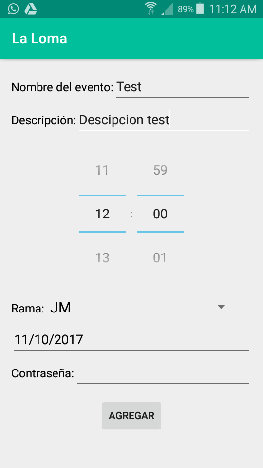
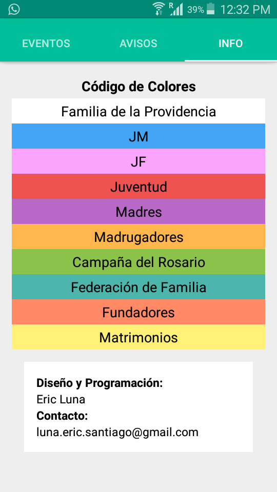

# **La-Loma**
## **Aplicación Android para el santuario de La Loma (Paraná)**

**"La Loma"** es una aplicación **móvil** basada en **Android** que tiene como objetivo proporcionar un calendario de eventos virtual que puede ser accesible desde cualquier celular que tenga la aplicación instalada.
Usa los servicios de **Firebase** "Database as a Service (DBaaS)" para guardar los eventos en la nube y **Cloud Messaging** (también de Firebase) para enviar notificaciones a los usuarios de cuando hay un nuevo evento.

